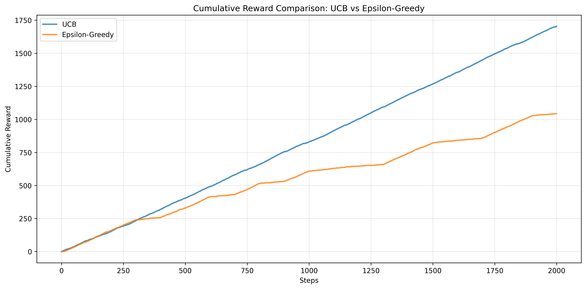

# Multi-Armed Bandits

This directory contains implementations of Multi-Armed Bandit algorithms. These algorithms address the exploration-exploitation trade-off in sequential decision-making problems.

## Overview

Multi-Armed Bandit problems model scenarios where an agent must choose between multiple options (arms) to maximize cumulative reward over time. Each choice provides a reward drawn from an unknown probability distribution, and the agent must balance exploring new options with exploiting known good options.

## Implementations

### UCB (Upper Confidence Bound)

The UCB algorithm is an optimistic approach that selects arms based on both their estimated value and the uncertainty in that estimate. It naturally balances exploration and exploitation by favoring arms with high uncertainty (not tried often) or high estimated value.

**File:** `UCB.ipynb`

**Key Features:**
- Deterministic exploration strategy
- Logarithmic regret bounds
- No tuning parameters needed beyond the confidence level

### Epsilon-Greedy Strategy

The Epsilon-Greedy algorithm is a simple yet effective approach that balances exploration and exploitation using a probability parameter ε (epsilon). With probability ε, it explores by choosing a random arm, and with probability (1-ε), it exploits by choosing the arm with the highest estimated value.

**File:** `Epsilon_Greedy_Strategy.ipynb`

**Key Features:**
- Simple implementation
- Tunable exploration rate (ε parameter)
- Good baseline performance
- Easy to understand and implement

## Results

### Cumulative Rewards Comparison

The graph above shows the cumulative rewards over time for both UCB and Epsilon-Greedy strategies, demonstrating their performance characteristics.

## Usage

Open the Jupyter notebooks to see detailed implementations, explanations, and visualizations of the bandit algorithms in action.

## Theory

Bandit algorithms are fundamental to reinforcement learning and have applications in:
- A/B testing
- Clinical trials
- Recommendation systems
- Resource allocation
- Online advertising

## References

- Auer, P., Cesa-Bianchi, N., & Fischer, P. (2002). Finite-time analysis of the multiarmed bandit problem. Machine Learning.
