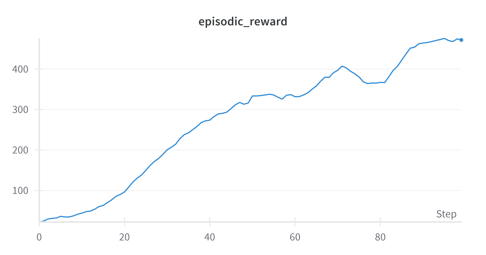
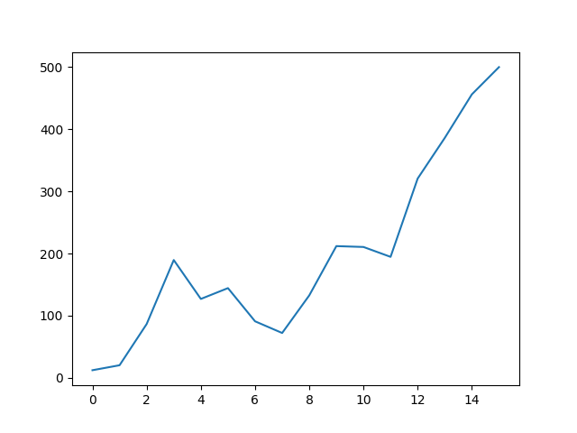
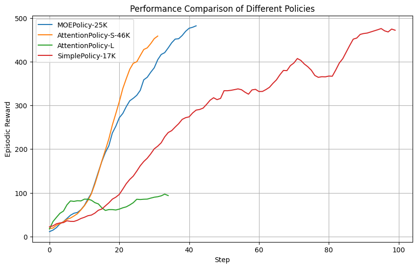

# REINFORCE Algorithm Implementations

This directory contains two implementations of the same REINFORCE algorithm (Williams, 1992): a standard single-agent version and a parallelized JAX version that trains multiple agents at the same time.

## Algorithm Overview

REINFORCE is a Monte Carlo policy gradient method that directly optimizes the policy by:
1. Collecting complete episodes using the current policy
2. Computing returns for each time step
3. Using policy gradients to update the policy parameters

## Implementation Comparison

| Aspect | Standard REINFORCE | Parallel-JAX REINFORCE |
| --- | --- | --- |
| Agents | Single agent | Multiple agents in parallel |
| Execution | Sequential rollouts | Parallelized rollouts with JAX |
| Environment | CartPole-v1 | CartPole-v1 |
| Framework | JAX/Flax | JAX/Flax |
| Policy network | Multi-layer perceptron with ReLU activations | Multi-layer perceptron with ReLU activations |
| Optimizer | Adam from Optax | Adam from Optax |

## Directory Structure

- `standard/` - Standard single-agent REINFORCE implementation
  - `CartPole/Simple-Reinforce.ipynb` - Standard REINFORCE algorithm
  - `CartPole/MOE-Reinforce.ipynb` - Mixture of Experts based REINFORCE algorithm
  - `assets/standard-Reward_Over_Time.png` - Training rewards visualization
  - `assets/standard-Loss.png` - Training loss visualization
  - `assets/standard-anim.gif` - Visualization of trained agent
  - `assets/standard-network_comparison.png` - Network analysis visualization
- `parallel-jax/` - Parallelized REINFORCE implementation in JAX
  - `main.py` - Parallel training entry point
  - `train.py` - Training loop
  - `assets/parallel-jax-Reward_Over_Time.png` - Training rewards visualization

## Features

- Policy network with configurable architecture
- Episode collection and reward computation
- Policy gradient updates using JAX transformations
- Training loop with progress tracking

## Standard REINFORCE

- Single-agent CartPole implementation
- Notebook location: `standard/CartPole/Simple-Reinforce.ipynb`
- Reward over time:



## Parallel-JAX REINFORCE

- Multi-agent parallel CartPole implementation
- Entry point: `parallel-jax/main.py`
- Reward over time:



## Training Results

The reward plots above are shown separately so both implementations get the same visual weight. They solve the same algorithmic problem with different execution styles.

### Network Analysis



## Usage

Run the Jupyter notebooks in `standard/CartPole/` to train the standard REINFORCE agents, or use the JAX parallel implementation in `parallel-jax/` to train multiple agents concurrently. Both versions follow the same core steps:
- Environment setup
- Policy network definition
- Return computation
- Policy-gradient update
- Performance monitoring

## Dependencies

```bash
pip install gymnax jax flax optax wandb tqdm gymnasium imageio
```

## References

Williams, R. J. (1992). Simple statistical gradient-following algorithms for connectionist reinforcement learning. Machine learning, 8(3-4), 229-256. 