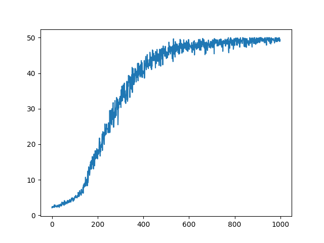

# Reinforcement Learning Algorithms

This repository contains implementations of various reinforcement learning algorithms. The goal is to provide clean, educational implementations of RL algorithms using modern deep learning frameworks.

## Structure

- `Bandits/` - Contains Multi-Armed Bandit algorithm implementations
  - UCB (Upper Confidence Bound) algorithm
  
- `Reinforce/` - REINFORCE algorithm implementations
  - Standard single-agent implementation
  - Parallelized JAX implementation

- `SARSA/` - SARSA algorithm implementation
  - On-policy action-value learning for the CartPole environment
  - Epsilon-greedy action selection

- `ActorCritic/` - Actor-Critic algorithm implementation
  - JAX/Flax implementation for the CartPole environment
  - Includes batched training with parallel environment rollouts

## ActorCritic

This implementation uses an actor-critic network to learn CartPole-v1 with JAX and Flax. The batched training version uses `jax.vmap` to run multiple episodes in parallel and updates the actor and critic from the collected trajectories.

### Batched Learning Results

The episodic reward improves throughout training and approaches the CartPole reward limit of 50.

## Reinforce

REINFORCE is a Monte Carlo policy-gradient algorithm that learns a policy by collecting complete episodes, computing returns, and updating the policy using those returns. This repository includes both a standard single-agent implementation and a parallelized JAX implementation that trains multiple agents at the same time.

### Parallel-JAX Training Results

The parallel implementation uses JAX to collect and process multiple rollouts concurrently.

## SARSA

SARSA is an on-policy temporal-difference learning algorithm. It updates the action-value estimate using the current state, action, reward, next state, and next action selected by the same epsilon-greedy policy. The implementation uses JAX and Flax with CartPole-v1.

The update follows the SARSA target:

`Q(s, a) <- Q(s, a) + alpha [r + gamma Q(s', a') - Q(s, a)]`

## Getting Started

Each algorithm directory contains its own README with specific implementation details and usage instructions.

## Dependencies

The implementations primarily use:
- JAX for high-performance computing
- Flax (Neural Networks library for JAX)
- Gymnax for RL environments
- Optax for optimization

## Contributing

Feel free to contribute additional RL algorithm implementations or improvements to existing ones.
