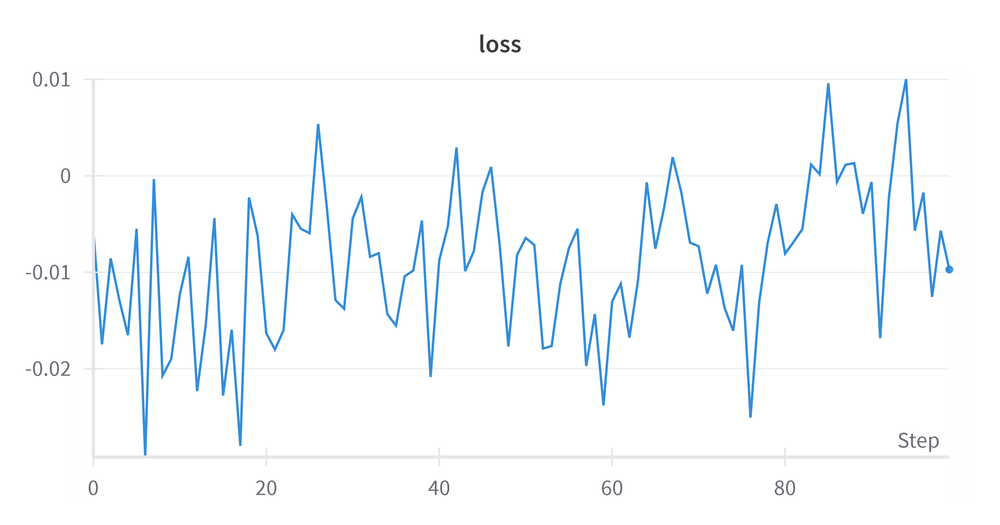
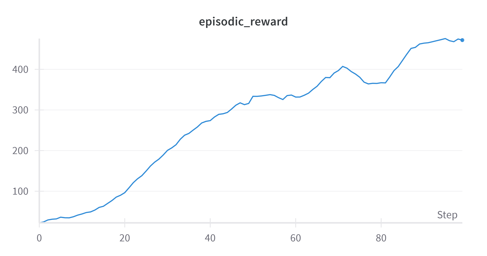

# REINFORCE Algorithm Implementation

This directory contains an implementation of the REINFORCE algorithm (Williams, 1992) using JAX and Flax.

## Algorithm Overview

REINFORCE is a Monte Carlo policy gradient method that directly optimizes the policy by:
1. Collecting complete episodes using the current policy
2. Computing returns for each time step
3. Using policy gradients to update the policy parameters

## Implementation Details

- **Framework**: JAX/Flax for automatic differentiation and neural networks
- **Environment**: CartPole-v1 from Gymnax
- **Policy Network**: Multi-layer perceptron with ReLU activations
- **Optimizer**: Adam optimizer from Optax

## Directory Structure

- `CartPole/` - Implementation for the CartPole environment
  - `reinforce.ipynb` - Jupyter notebook containing the complete implementation
  - `Loss.png` - Training loss visualization
  - `Reward_Over_Time.png` - Training rewards visualization

## Features

- Policy network with configurable architecture
- Episode collection and reward computation
- Policy gradient updates using JAX transformations
- Training loop with progress tracking

## Training Results

The following plots show the training progress of the REINFORCE algorithm:

### Loss Over Time


### Reward Over Time


## Usage

Run the Jupyter notebook in the CartPole directory to train the REINFORCE agent on the CartPole environment. The implementation includes:
- Environment setup
- Policy network definition
- Training loop
- Performance monitoring

## Dependencies

```bash
pip install gymnax jax flax optax wandb tqdm
```

## References

Williams, R. J. (1992). Simple statistical gradient-following algorithms for connectionist reinforcement learning. Machine learning, 8(3-4), 229-256. 